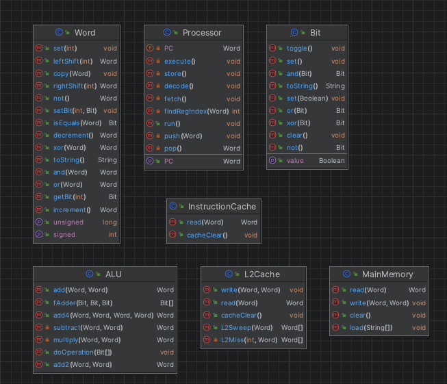

# Processor
## What does it do?
The processor simulates the execution of 32 bit length instructions belonging to the SIA32 ISA

A SIA32 Assembler is also included and built for a custom assembly language created by myself. 
Some example programs are also included.

Project features include: 
- the Processor
- Main Memory
- the ALU
- L1 instruction cache and L2 cache
## How to use the Processor...
1. clone the repository and build the project
2. execute the main method and pass the file path to your assembly program as the first argument
---

